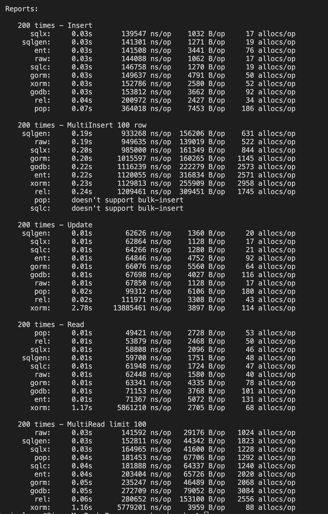

# sqlgen

[](https://github.com/si3nloong/sqlgen/actions?query=workflow%3Atest)
[](https://goreportcard.com/report/github.com/si3nloong/sqlgen)
[](https://codecov.io/gh/si3nloong/sqlgen)
[](https://github.com/si3nloong/sqlgen/blob/main/LICENSE)

> sqlgen 不是 ORM，而是代码生成器。它会解析 Go 结构并为您生成所需的结构方法。

## 什么是 sqlgen？

- **sqlgen 基于代码优先方法** — 您不需要首先编写 SQL，而是使用 Go 代码。
- **sqlgen 支持代码生成** — 我们生成烦人的部分，让您可以快速构建您的应用程序。
- **sqlgen 优先性能** — 大多数事情将在编译时而不是运行时定义。
- **sqlgen 支持泛型** — 我们使用泛型来消除运行时反射成本并减少内存分配。
- **sqlgen 消除副作用** - 当修改模型时，您将获得预期的结果而不是副作用。

## SQL 数据库支持

| Driver     | Support |
| ---------- | :-----: |
| `mysql`    |   ✅    |
| `postgres` |   ✅    |
| `sqlite`   |   ✅    |

## 快速入门

1. 安装 sqlgen。

   ```console
    go install github.com/si3nloong/sqlgen@main
   ```

2. 定义您的结构。

    <h5 a><strong><code>model/user.go</code></strong></h5>

   ```go
   package model

   import "time"

   type LongText string

   type User struct {
       ID      int64 `sql:",auto_increment"`
       Name    string
       Age     uint8
       Address LongText
       Created time.Time
   }
   ```

3. 生成输出文件。

   ```bash
   # sqlgen generate <source_file>
   sqlgen generate model/user.go
   ```

4. 生成的代码如下：

   <h5 a><strong><code>model/generated.go</code></strong></h5>

   ```go
   // Code generated by sqlgen, version v1.0.0-alpha.4. DO NOT EDIT.

   package model

   import (
       "database/sql/driver"
       "time"

       "github.com/si3nloong/sqlgen/sequel/types"
   )

   func (User) CreateTableStmt() string {
       return "CREATE TABLE IF NOT EXISTS `user` (`id` BIGINT NOT NULL AUTO_INCREMENT,`name` VARCHAR(255) NOT NULL,`age` TINYINT UNSIGNED NOT NULL,`address` VARCHAR(255) NOT NULL,`created` DATETIME NOT NULL,PRIMARY KEY (`id`));"
   }
   func (User) AlterTableStmt() string {
       return "ALTER TABLE `user` MODIFY `id` BIGINT NOT NULL AUTO_INCREMENT,MODIFY `name` VARCHAR(255) NOT NULL AFTER `id`,MODIFY `age` TINYINT UNSIGNED NOT NULL AFTER `name`,MODIFY `address` VARCHAR(255) NOT NULL AFTER `age`,MODIFY `created` DATETIME NOT NULL AFTER `address`;"
   }
   func (User) TableName() string {
       return "`user`"
   }
   func (User) Columns() []string {
       return []string{"`id`", "`name`", "`age`", "`address`", "`created`"}
   }
   func (v User) IsAutoIncr() {}
   func (v User) PK() (columnName string, pos int, value driver.Value) {
       return "`id`", 0, int64(v.ID)
   }
   func (v User) Values() []any {
       return []any{int64(v.ID), string(v.Name), int64(v.Age), string(v.Address), time.Time(v.Created)}
   }
   func (v *User) Addrs() []any {
       return []any{types.Integer(&v.ID), types.String(&v.Name), types.Integer(&v.Age), types.String(&v.Address), (*time.Time)(&v.Created)}
   }
   ```

更多帮助以开始使用：

- [入门教程](/docs/GET_STARTED-zh.md) - 一份全面的指南，以帮助您入门
- [CLI 指南](/docs/CLI-zh.md) 用于 CLI 命令的指南。
- [FAQ（常见问题解答）](/docs/FAQ-zh.md) - 常见的问题解答。
- [配置文件](/docs/CONFIGURATION-zh.md) - 配置代码生成。

## 基准测试



## 报告问题

如果您认为发现了错误，或某些事情的行为不如您所期望，请在 GitHub 上提出[问题](https://github.com/si3nloong/sqlgen/issues)。

## 贡献

我们欢迎贡献，阅读我们的[贡献指南](https://github.com/si3nloong/sqlgen/blob/main/CONTRIBUTING.md)以了解更多关于对**sqlgen**进行贡献的信息。

## 特别感谢

感谢这些公司支持开源开发者 ❤

[](https://github.com/open-source)

## 灵感来自

- [在 Go 中不需要 ORM](https://medium.com/@enverbisevac/you-dont-need-orm-in-go-9216fb74cdfd)
- [gqlgen](https://github.com/99designs/gqlgen)

## 许可证

[MIT](https://github.com/si3nloong/sqlgen/blob/main/LICENSE)

版权所有 (c) 2023-present，SianLoong Lee
