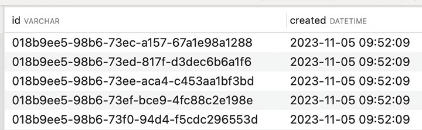
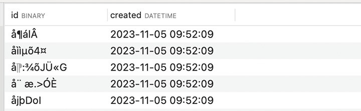

# UUID Data Type

There are 2 common type of UUID:

- [UUID in string format](#uuid-in-string-format)
- [UUID in binary format](#uuid-in-binary-format)

`sqlgen` is smart enough to identify it's a SQL UUID data type. For example, using package [github.com/gofrs/uuid](https://github.com/gofrs/uuid) or [github.com/google/uuid](https://github.com/google/uuid) will work like a charm, but it doesn't limit you to use other uuid package, it will work as long as the underlying go type is `[16]byte`.

### UUID in string format

> Store UUID value in human readable format using VARCHAR(36) data type.



<h5 a><strong><code>model/user.go</code></strong></h5>

```go
package model

import (
	"time"

	"github.com/google/uuid"
)

type User struct {
	ID      uuid.UUID `sql:",pk"`
	Created time.Time
}
```

<h5 a><strong><code>model/generated.go</code></strong></h5>

```go
// Code generated by sqlgen, version v1.0.0-alpha.4. DO NOT EDIT.

package model

import (
	"database/sql"
	"database/sql/driver"
	"time"
)

func (User) CreateTableStmt() string {
	return "CREATE TABLE IF NOT EXISTS `user` (`id` VARCHAR(36) NOT NULL,`created` DATETIME NOT NULL,PRIMARY KEY (`id`));"
}
func (User) AlterTableStmt() string {
	return "ALTER TABLE `user` MODIFY `id` VARCHAR(36) NOT NULL,MODIFY `created` DATETIME NOT NULL AFTER `id`;"
}
func (User) TableName() string {
	return "`user`"
}
func (User) Columns() []string {
	return []string{"`id`", "`created`"}
}
func (v User) IsAutoIncr() {}
func (v User) PK() (columnName string, pos int, value driver.Value) {
	return "`id`", 0, (driver.Valuer)(v.ID)
}
func (v User) Values() []any {
	return []any{(driver.Valuer)(v.ID), time.Time(v.Created)}
}
func (v *User) Addrs() []any {
	return []any{(sql.Scanner)(&v.ID), (*time.Time)(&v.Created)}
}
```

### UUID in binary format

> Store UUID value in non-human readable format using BINARY(16) data type.



<h5 a><strong><code>model/user.go</code></strong></h5>

```go
package model

import (
	"time"

	"github.com/google/uuid"
)

type User struct {
	ID      uuid.UUID `sql:",pk,binary"`
	Created time.Time
}
```

<h5 a><strong><code>model/generated.go</code></strong></h5>

```go
// Code generated by sqlgen, version v1.0.0-alpha.4. DO NOT EDIT.

package model

import (
	"database/sql/driver"
	"time"

	"github.com/si3nloong/sqlgen/sequel/types"
)

func (User) CreateTableStmt() string {
	return "CREATE TABLE IF NOT EXISTS `user` (`id` BINARY(16) NOT NULL,`created` DATETIME NOT NULL,PRIMARY KEY (`id`));"
}
func (User) AlterTableStmt() string {
	return "ALTER TABLE `user` MODIFY `id` BINARY(16) NOT NULL,MODIFY `created` DATETIME NOT NULL AFTER `id`;"
}
func (User) TableName() string {
	return "`user`"
}
func (User) Columns() []string {
	return []string{"`id`", "`created`"}
}
func (v User) IsAutoIncr() {}
func (v User) PK() (columnName string, pos int, value driver.Value) {
	return "`id`", 0, types.BinaryMarshaler(v.ID)
}
func (v User) Values() []any {
	return []any{types.BinaryMarshaler(v.ID), time.Time(v.Created)}
}
func (v *User) Addrs() []any {
	return []any{types.BinaryUnmarshaler(&v.ID), (*time.Time)(&v.Created)}
}
```
